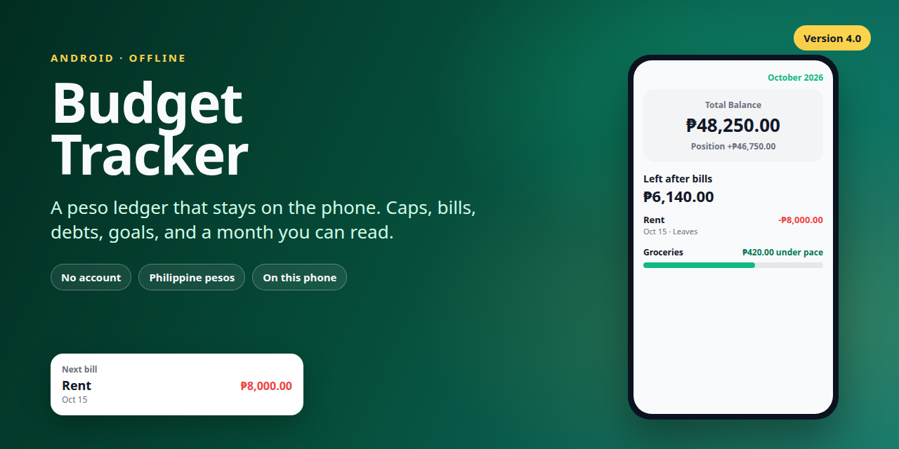
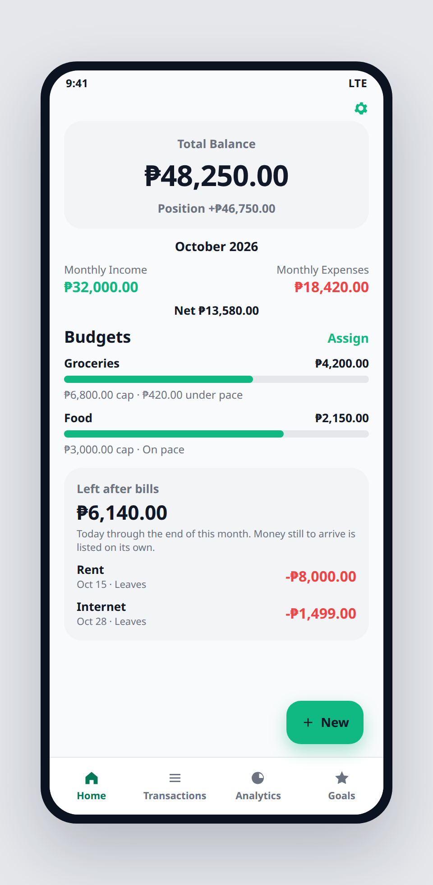
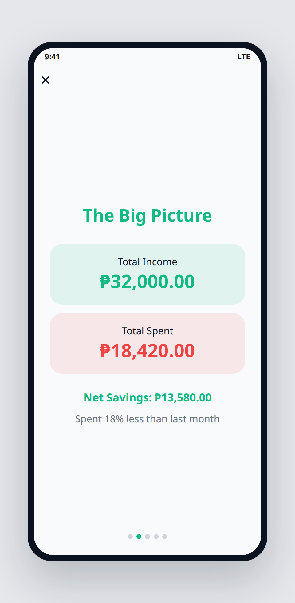
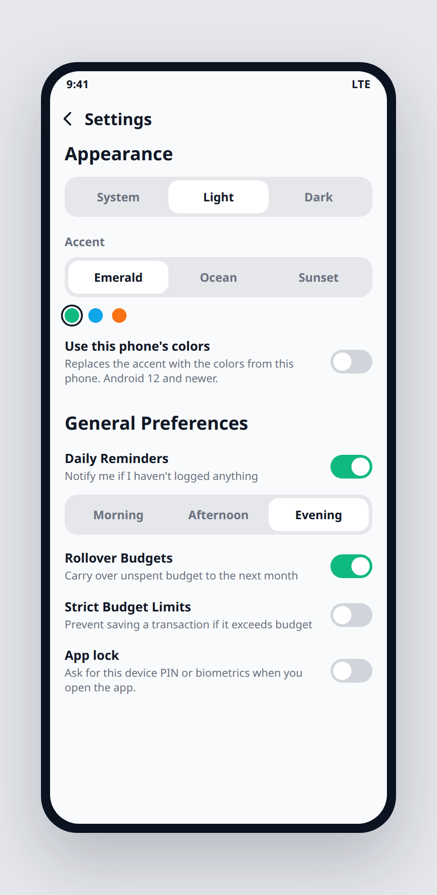

# Budget Tracker

An offline budget tracker for Android. Amounts are Philippine pesos, stored as centavos on the phone. There is no account to sign in to, and the app does not ask for the internet.

Version 4.0 · Android 7.0 and newer · [MIT](LICENSE)



<p align="center">
  
  
  
</p>

<p align="center"><sub>These pictures are drawn to match the screens. They are not photos from a phone.</sub></p>

## What you can do

**Home.** The total is the wallets you include. Position adds what people owe you and subtracts what you owe. Left after bills runs from today through the end of the current month, and lists money still on the way by itself. Each budget row can say whether you are on pace, over pace, or under pace. Assign sets this month's base.

**Caps.** A category cap is that month's base, plus rollover when rollover is on. A base of zero with rollover off means no cap. Strict limits start off. While they are off, going past a cap or a 50/30/20 bucket warns you and still offers Save anyway. Turn strict limits on in Settings to block that save.

**Logging.** Record income and expenses, move money between wallets, or split one expense across categories. A receipt photo from the gallery is read on the device: the total fills the amount, and the merchant line fills the note. There is no in-app camera.

**Repeat.** A rule can be daily, weekly, semi-monthly (the 15th and the last day), monthly, or yearly. Pause it, or give it an end date. A paused rule skips the dates it missed.

**Debts and goals.** A debt is either "they owe me" or "I owe them." Settling it posts the wallet rows. A goal is funded by moving money into a savings wallet, so the move stays out of spending unless you mark it as an expense.

**The month in review.** Trends cover six months: cashflow columns, and a line for what was left after spending. Transfers stay out of both. The open month stays out of the average. Monthly wrapped walks through the month and can share a plain-text summary.

**On this phone.** Light, dark, or follow the system. The accent is Emerald, Ocean, or Sunset. On Android 12 and newer, the phone's own colors can replace the accent. That switch starts off. A daily reminder can fire in the morning, the afternoon, or the evening. App lock uses this phone's PIN or biometrics. The next-bill widget reads the same local database, including while the lock is on.

A fresh install starts with Cash and Bank, and 25 categories with icons. It does not invent budget caps. If you already had categories, missing preset names are added once.

## Files you can keep

JSON backup is the full ledger: wallets, categories, transactions, limits, goals, debts, recurring rules, and preferences. Restoring it replaces what is on this phone. The backup leaves out the app lock. If an older file has no accent, phone-color switch, or reminder hour, those come back as Emerald, off, and evening.

CSV is separate. Export writes `date,wallet,category,type,amount,note,classification`. Import reads a file in that same shape and does not replace the JSON restore.

## Build

JDK 11 and an Android SDK are enough.

```bash
./gradlew :app:assembleDebug
./gradlew :app:testDebugUnitTest
```

The installable package for version 4.0 is on the [releases](https://github.com/dj-secq/budget-tracker/releases) page.

| | |
| --- | --- |
| Language | Kotlin |
| UI | Jetpack Compose, Material 3 |
| Storage | Room |
| Charts | Vico |
| Receipt text | ML Kit, on the device |
| Background work | WorkManager |
| minSdk / targetSdk | 24 / 36 |

## License

[MIT](LICENSE). Copyright (c) 2026 dj-secq.
