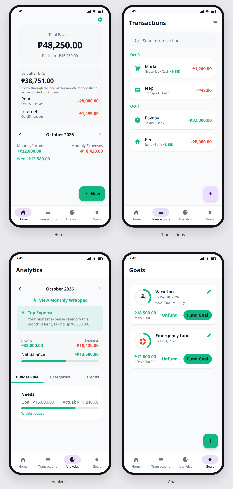

<p align="center">
  
</p>

<h1 align="center">Budget Tracker</h1>

<p align="center">
  A budget for one person, on one Android phone.<br>
  The ledger stays on the device, in Philippine pesos.<br>
  There is no account and no cloud.
</p>

<p align="center">
  
</p>

<p align="center">
  Green is money in, room left, or a goal still open. Red is money out, or past the line.<br>
  The pictures use the app’s type, colors, and layout, with a sample October filled in.
</p>

Android 7.0 and later. This is version 4.0.

## Home

Home shows the total of the wallets you include, then Position. Position adds what is owed to you and subtracts what you owe. Left after bills runs from today through the end of the month. Money still on the way is listed, and it stays out of that figure.

Under the month are income, spending, and the net. A budget row shows what is left of the cap, and whether spending is on pace. Assign sets this month’s base. Unspent money can roll into the next month when rollover is on.

## Transactions

The ledger groups rows by day. Search covers the note. A filter can narrow by category, wallet, or dates. Swipe a row to delete it, and tap a row to change it.

One expense can be split across categories. The parts are one purchase. Deleting one line removes the group.

## Analytics

Analytics opens on the 50/30/20 rule, then categories, then six months of cashflow and leftover. Transfers stay out of income and spending. The open month stays out of the average.

Monthly wrapped is a few pages for that month. The last page shares a plain-text note.

## Goals

A goal shows what is saved against the target. Fund moves money into a savings wallet. That move is not spending unless you say it is.

Debts sit on Home. One kind is money owed to you. The other is money you owe. Settling a debt posts the wallet rows.

## Widget

The home-screen widget shows the next bill still due this month. It reads the same ledger, including while the app lock is on.

## Settings

Settings cover light, dark, or the system theme, and an Emerald, Ocean, or Sunset accent. On Android 12 and newer, the phone’s own colors can replace the accent. That switch starts off. The daily reminder can be morning, afternoon, or evening. Strict limits start off, so an over-budget save warns you and still offers Save anyway.

Backup is a JSON file you export yourself. Restoring it replaces the ledger on this phone. The lock setting stays on the phone. CSV is the transactions only, and that same file can be imported without replacing the backup.

A fresh install starts with Cash, Bank, and 25 categories. It does not set a cap on any of them.

## Build

Requirements: Android Studio, JDK 11, and Android SDK 36.

1. Open the project in Android Studio.
2. Sync Gradle.
3. Run the `app` configuration on a device or emulator.

```bash
./gradlew :app:assembleDebug
```

The package for 4.0 is on the [releases](https://github.com/dj-secq/budget-tracker/releases) page.

## In the repo

- `app/` is the Android application.
- `app/schemas/` is the Room history.
- [LICENSE](LICENSE) is MIT. Copyright (c) 2026 dj-secq.
